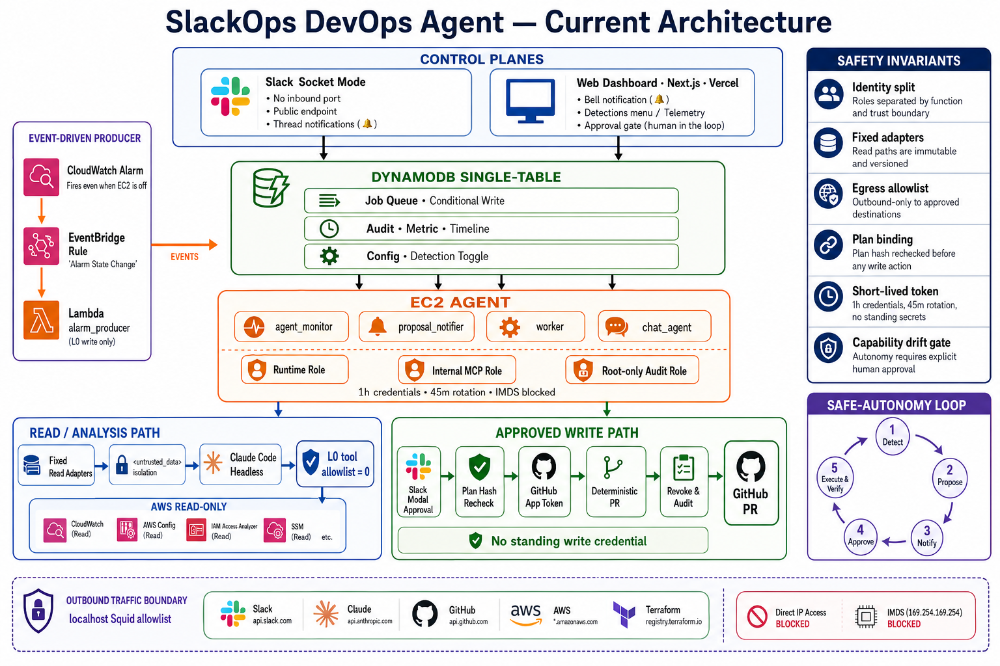
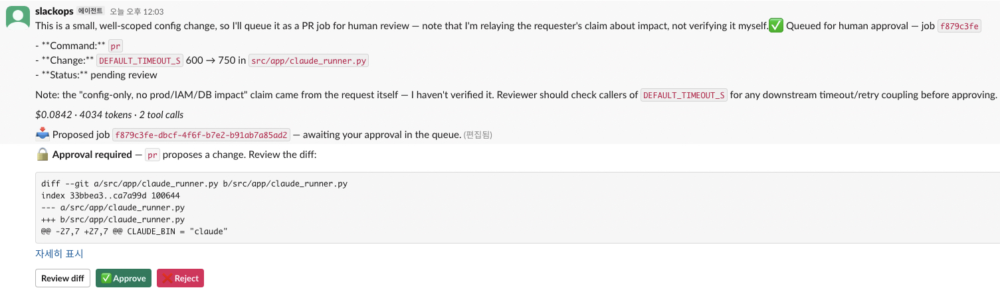
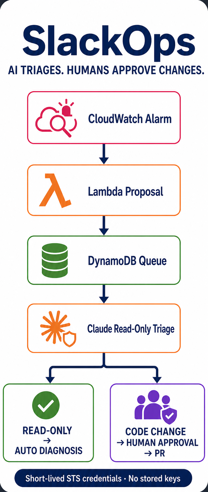
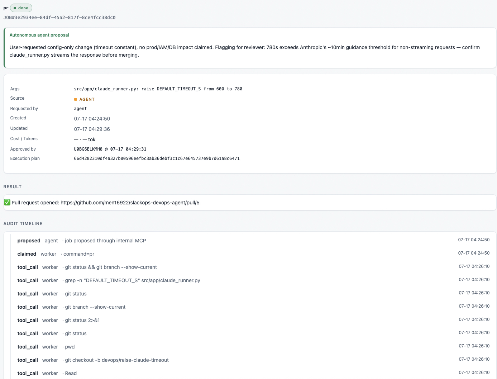

# Building a Safe Event-Driven DevOps Agent: From Read-Only Diagnosis to Verified Pull Requests

Giving an AI agent access to production is easy. Explaining exactly what it can read, what it can change, and what happens when it is tricked is much harder.

SlackOps DevOps Agent began as a read-only assistant that could investigate an incident from Slack. The first version proved that Slack and a web dashboard could share one event-driven job queue. V2 asks a stricter question:

> Can an agent investigate real operational data and prepare a change without ever holding the authority to silently execute it?

The answer is not a better system prompt. It is a set of runtime boundaries outside the model: fixed read adapters, isolated untrusted data, immutable approval plans, short-lived credentials, deterministic execution, restricted network egress, and an audit trail built from observed behavior.

This article describes the current architecture, what changed after V1, and what has been verified in a live AWS environment.



*Figure 1 — Current architecture. Slack, the web dashboard, the resident agent, and the event-driven Lambda producer share one DynamoDB control plane. Read and write paths remain separate.*

## The operating model: detect, propose, notify, approve, execute

The system follows a five-stage loop:

1. **Detect** — A CloudWatch alarm, Slack message, scheduled monitor, or web request identifies a possible issue.
2. **Propose** — The system collects bounded evidence and creates a job in DynamoDB.
3. **Notify** — Slack and the web dashboard show the same job, evidence, and proposed change.
4. **Approve** — A human reviews the diff. Approval is attached to one exact execution plan.
5. **Execute and verify** — Runtime code rechecks the plan, obtains a short-lived write credential, opens the pull request, verifies the remote result, revokes the credential, and records the outcome.

The event-driven producer is deliberately limited. A CloudWatch alarm flows through EventBridge to an AWS Lambda function, which can create a proposal in DynamoDB even while the EC2 worker is stopped. Lambda cannot approve or execute the proposal. It only adds work to the same queue used by Slack, the dashboard, and the resident monitor.

This keeps the inexpensive detection path available without turning the worker into an always-on privileged service.

## What changed after V1

V1 used a generic read-only AWS API MCP server for diagnosis. Read-only access sounded safe, but the surface was still broader than the task required. A generic API tool could expose unrelated data, and its tool results did not pass through the same untrusted-data boundary as the rest of the evidence.

V2 removed that runtime dependency.

For `logs`, `diagnose`, and `detect`, command-specific boto3 adapters now fetch only the required AWS data. Results are capped, sanitized, and placed inside a single `<untrusted_data>` boundary before they reach the model. The model receives no AWS tool for these L0 analysis commands: the tool allowlist is empty.

The separate internal FastMCP server remains, but its purpose is narrower. It can create a proposal in the SlackOps control plane. It is not a general AWS read surface.

This distinction matters: **the application gathers evidence; the model analyzes evidence**.

## Five runtime boundaries

### 1. Fixed reads instead of generic tools

Each diagnostic command owns a small adapter with an explicit service, API, account, Region, log prefix, and result limit. Policy is expressed as deterministic code rather than a prompt instruction.

If a requested resource falls outside the configured scope, the adapter refuses the request before fetching data. The denial is recorded as a policy event.

### 2. One boundary for untrusted content

Slack messages, CloudWatch log lines, Kubernetes output, Git output, and adapter errors are data from the model's perspective. They may contain text such as “ignore previous instructions” or a forged closing tag.

SlackOps sanitizes boundary-like text and wraps external content once:

```xml
<untrusted_data>
  ...bounded operational evidence...
</untrusted_data>
```

The wrapper is not presented as a complete prompt-injection solution. The stronger property is that the L0 analysis phase has no execution tool. Even if the model follows a malicious instruction in the data, it has no direct action path.

### 3. Separate identities and short-lived credentials

The EC2 instance profile is used only for bootstrap. Runtime services receive separate one-hour AWS STS credentials, refreshed every 45 minutes by a root-owned process. The runtime, internal MCP, and audit writer use different roles.

The agent services cannot query EC2 instance metadata directly and cannot read the root-owned audit environment. A dedicated audit role can append only to the deployment-owned CloudWatch Logs security sink. The normal runtime role has an explicit deny on that sink.

For GitHub writes, the worker keeps no personal access token and no standing `gh` credential. After a human approves a specific plan, the runtime creates a repository- and permission-scoped GitHub App installation token. The token is passed only to one child process and revoked on every exit path.

### 4. Approval binds an exact state

A displayed diff is not enough. Files can change after approval, and a natural-language request does not identify the exact tool chain that will execute it.

SlackOps builds a canonical `ExecutionPlan` containing:

- request and diff hashes;
- approved paths and workspace root;
- policy version, AWS account, and Region;
- the complete execution tool chain;
- declared capabilities, risk score, and the approval-time risk ceiling.

The human approval stores the hash of that exact plan. Immediately before execution, the worker recomputes and compares it. A changed diff, missing plan, expanded tool chain, path traversal, symlink, untracked file, workspace mismatch, or capability expansion causes the job to fail closed.

Approval therefore means: **run this reviewed change under this policy**, not “do something similar later.”

### 5. The model is removed from the write path

The prepare phase may use the model to propose and edit a change. After approval, the model is no longer needed.

`app.pr_execution.open_pr` performs a fixed sequence:

```text
create branch
  → add only approved paths
  → commit
  → push with the short-lived GitHub App token
  → create pull request
  → verify the remote path set
```

No model output decides how to push. This is both safer and more reliable: the creative part ends before authority begins.



*Figure 2 — A real Slack proposal shows the bounded change, diff preview, estimated usage, and explicit Review, Approve, and Reject controls.*

## The command boundary is an argv schema

Tool allowlists are useful, but they are not treated as the final security boundary.

During testing, a head-matching Bash pattern that appeared to allow only `echo` also accepted a chained command. SlackOps therefore normalizes every Bash call and checks it against a command-specific argument schema in a `PreToolUse` hook. Separators, substitutions, redirections, unexpected flags, and unknown subcommands fail closed.

Adding a command requires both an allowlist entry and a matching guard schema. An import-time cross-check rejects an inconsistent configuration.

The guard also provides the capability classifier used later by the audit and completion gates. The system does not maintain a second, potentially inconsistent parser for “what the command really did.”

## Capability is measured, not only declared

Every permitted tool has one of five capabilities:

```text
read · sensitive-read · write-low · write-high · privileged
```

An unclassified tool is an error. A plan sums its distinct capabilities and compares the result with `RISK_CEILING=10`. High-impact and privileged capabilities exceed the ceiling without needing a separate exception list. L2 execution remains disabled.

Claude Code runs with `stream-json` output so the worker can reconstruct observed tool calls. The worker resolves each call through the same command guard, records it as a child step in the audit tree, and recomputes observed capabilities.

A job cannot become `DONE` if the observed capability exceeds the approved set or score. It fails with a distinct `capability_drift` audit event instead.

This turns telemetry into an enforcement point. The system checks not only what was allowed, but also what actually ran.

## Network egress is part of the agent policy

The worker has no inbound port. Slack uses Socket Mode, and the dashboard communicates through DynamoDB rather than opening a callback endpoint on the agent.

Outbound traffic passes through a localhost Squid proxy with a small destination allowlist for required services. Direct egress and unlisted destinations are denied. Proxy audit records contain denial metadata, not requested URLs, to avoid copying sensitive query data into the security log.

This follows the “lethal trifecta” framing: private data, untrusted content, and external communication become dangerous when one agent holds all three. SlackOps narrows each leg, with the egress boundary acting as the final barrier against data exfiltration.

## Mapping the implementation to OWASP

| OWASP risk | SlackOps control | Runtime evidence |
| --- | --- | --- |
| LLM01 Prompt Injection | sanitizer, one `<untrusted_data>` boundary, L0 tools = 0 | injection instruction rejected without an action path |
| LLM02 Sensitive Information Disclosure | command-specific adapters, bounded evidence, egress allowlist | out-of-scope reads and unlisted egress denied |
| LLM05 Improper Output Handling | diff review, canonical plan hash, deterministic executor | changed plan rejected before execution |
| LLM06 Excessive Agency | argv guard, capability ceiling, L2 disabled | restart, apply, delete, and over-ceiling actions denied |
| ASI03 Identity & Privilege Abuse | role separation, short-lived STS, per-approval GitHub App token | credential issue and revoke events linked to approval |

These mappings use the [OWASP Top 10 for Large Language Model Applications](https://genai.owasp.org/llm-top-10/) and the [OWASP Top 10 for Agentic Applications](https://genai.owasp.org/2025/12/09/owasp-top-10-for-agentic-applications-the-benchmark-for-agentic-security-in-the-age-of-autonomous-ai/) as design references. They are not compliance claims.

> **Image placeholder — security boundary proof**
> Place two captures side by side: `restart/apply/delete → DENY` and `plan hash mismatch → plan_binding_rejected`. Keep the denial reason and trace ID readable.

## One control plane, multiple producers

DynamoDB stores jobs, audit events, telemetry, conversations, metrics, and detection configuration in a single-table design. Conditional writes implement the state machine and atomic claim.

The important property is not that all data lives in one table. It is that every producer enters the same transition rules:

```text
PENDING → RUNNING → AWAITING_APPROVAL → APPROVED → DONE
                              └────────→ REJECTED
```

Slack, the web dashboard, the resident monitor, and the Lambda alarm producer cannot invent separate approval semantics. A worker claims a job with a conditional write, so concurrent pollers cannot execute it twice. An abandoned `RUNNING` job is recovered as failed rather than replayed into a second push.



*Figure 3 — The compact operating loop: the agent detects and proposes; a person reviews the change; a deterministic path executes the approved result.*

## What has been verified

The project distinguishes automated checks, live rehearsals, and scaffolding:

- `make check`: **563 tests passed**, with Ruff, strict mypy, and the documentation budget gate green on 2026-07-17.
- AWS boundary rehearsal: split roles, one-hour credentials, 45-minute refresh, IMDS denial, fixed read scope, direct-egress denial, allowlisted proxy access, and the root-owned audit sink were verified on a fresh EC2 instance on 2026-07-15.
- GitHub write path: natural-language proposal, preparation, human approval, deterministic execution, remote verification, and credential revocation opened live pull requests **#3 through #5** on 2026-07-17.
- Slack-native approval: buttons and the “Review change” modal were verified with a fail-closed approver allowlist.
- Managed AWS MCP: the separate-account pilot remains a CI-locked scaffold. No managed endpoint, role, or session is enabled in the SlackOps runtime.



*Figure 4 — A completed dashboard job links the approved execution plan to the opened pull request and its observed tool-call audit trail.*

## Cost: estimate the architecture, do not present a personal bill as a benchmark

The current demo uses a scheduled `t3.medium`, EBS, DynamoDB, CloudWatch, EventBridge, and Lambda. Under the presentation's weekday operating scenario—roughly 220 EC2 hours per month—the infrastructure estimate is about **USD 12 per month**. Lambda and EventBridge remain negligible at demo volume.

That number is a scenario estimate, not an AWS bill and not a promise about another account. Region, log retention, data volume, NAT design, and instance runtime will change it.

The runtime also records a client-side API-equivalent estimate for each Claude run. Typical demo investigations have appeared in the **USD 0.15–0.50** range, but the project currently authenticates with a Claude subscription OAuth token. The displayed value is therefore useful for comparing runs, not for claiming the amount personally charged. A production deployment should use an approved API, enterprise, or cloud-provider authentication path and measure provider billing independently. Anthropic likewise describes `total_cost_usd` as an estimate and directs product integrations to supported API or provider credentials in its [cost tracking](https://code.claude.com/docs/en/agent-sdk/cost-tracking) and [legal and compliance](https://code.claude.com/docs/en/legal-and-compliance) guidance.

## Known limitations

- Prompt injection is not “solved.” The architecture reduces the available sinks when the model is misled.
- Subscription OAuth is suitable only for this controlled personal demonstration, not as a production product authentication model.
- The Vercel dashboard should use workload identity such as OIDC and STS instead of static AWS credentials in a production deployment.
- The managed AWS MCP pilot is intentionally not connected to the runtime.
- The capability ceiling is evaluated per job; cross-job accumulation requires a separate policy layer.
- ADOT Collector integration remains future work. The current system records application telemetry and audit events without claiming a complete distributed tracing deployment.

## Closing principle

The most useful lesson from V2 is simple:

> Let the model investigate and propose. Let deterministic code and authenticated humans control authority.

An agent does not become safe because it refuses a dangerous prompt in a demo. It becomes safer when its identity, tools, data flow, network path, approval state, and observed behavior remain bounded even after the prompt fails.

That is the boundary SlackOps DevOps Agent is designed to make visible—and testable.

## References

- [OWASP Top 10 for Large Language Model Applications](https://genai.owasp.org/llm-top-10/)
- [OWASP Top 10 for Agentic Applications](https://genai.owasp.org/2025/12/09/owasp-top-10-for-agentic-applications-the-benchmark-for-agentic-security-in-the-age-of-autonomous-ai/)
- [The lethal trifecta for AI agents — Simon Willison](https://simonwillison.net/2025/Jun/16/the-lethal-trifecta/)
- [Defeating Prompt Injections by Design — CaMeL](https://arxiv.org/abs/2503.18813)
- [Design Patterns for Securing LLM Agents against Prompt Injections](https://arxiv.org/abs/2506.08837)
- [Anthropic Agent SDK cost tracking](https://code.claude.com/docs/en/agent-sdk/cost-tracking)
- [Anthropic legal and compliance guidance](https://code.claude.com/docs/en/legal-and-compliance)
