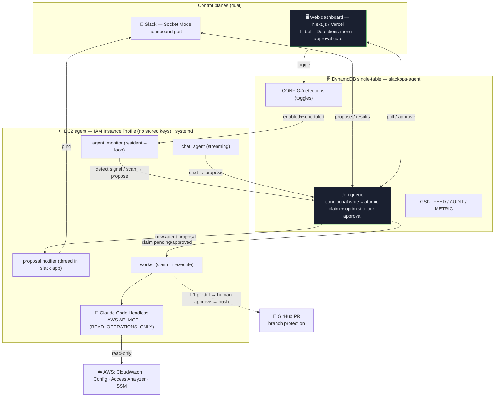

# Architecture diagram (source)

> Submission diagram source. Render the Mermaid block to PNG at [mermaid.live](https://mermaid.live)
> (or `mmdc -i architecture.md -o architecture.png`) → save as `docs/images/architecture.png`.
> ASCII fallback below. Reflects the safe-autonomy loop (F1–F5) on one DynamoDB single-table.

## Mermaid



## ASCII fallback

```
        ┌──────────────── Dual control plane ────────────────┐
        │  💬 Slack (Socket Mode, no inbound)   🖥️ Web/Vercel │
        │        ▲    │                          ▲   │        │
        └────────┼────┼──────────────────────────┼───┼────────┘
   Slack ping ── │    │ propose/results   poll/approve  │ toggle
        ┌────────┴────▼──────────────────────────▼───▼────────┐
        │   🗄️ DynamoDB single-table  (slackops-agent)         │
        │   queue: conditional write = atomic claim +          │
        │          optimistic-lock approval  ·  no coordinator │
        │   GSI2: FEED/AUDIT/METRIC   ·   CONFIG#detections     │
        └───▲────────────────▲───────────────────┬─────────────┘
   propose  │  enabled+sched  │ claim pending/approved
        ┌───┴────────────────┴───────────────────▼─────────────┐
        │ ⚙️ EC2 (IAM Instance Profile, systemd)                │
        │ agent_monitor → propose   notifier → Slack ping       │
        │ chat_agent → propose      worker → execute            │
        │ 🤖 Claude Code Headless + AWS API MCP (read-only) ─────┼──► ☁️ CloudWatch/Config/
        │ worker ─ L1 pr: diff→approve→push ─► 🐙 GitHub PR      │     AccessAnalyzer/SSM
        └──────────────────────────────────────────────────────┘
```

## Safety invariants (annotate on the diagram)
- **Socket Mode** = no inbound port / public endpoint.
- **IAM Instance Profile** = zero stored access keys; AWS MCP `READ_OPERATIONS_ONLY` → writes denied.
- **Permission L0/L1 only**; L2(Execute)/prod/IAM/DB = forbidden invariant.
- **Output gate**: L1 (pr) stops at `awaiting_approval` → human approves diff → push/PR (branch protection blocks auto-merge).
- **Injection defense (4-layer)**: untrusted-data isolation · tool allowlist · output gate · template prompt.

## The loop (highlight in the deck)
`monitor/chat detect → propose (queue) → 🔔 Slack ping + dashboard bell → human reads rationale → approval gate → worker executes → telemetry` — all over **one** DynamoDB table.
